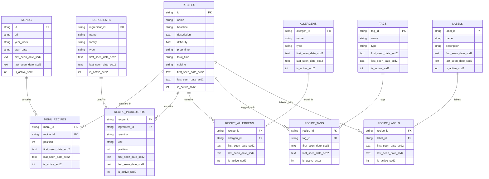

```mermaid
erDiagram 
    MENUS ||--o{ MENU_RECIPES : contains
    RECIPES ||--o{ MENU_RECIPES : appears_in

    RECIPES ||--o{ RECIPE_INGREDIENTS : contains
    INGREDIENTS ||--o{ RECIPE_INGREDIENTS : used_in

    RECIPES ||--o{ RECIPE_ALLERGENS : contains
    ALLERGENS ||--o{ RECIPE_ALLERGENS : found_in

    RECIPES ||--o{ RECIPE_TAGS : tagged_with
    TAGS ||--o{ RECIPE_TAGS : tags

    RECIPES ||--o{ RECIPE_LABELS : labeled_with
    LABELS ||--o{ RECIPE_LABELS : labels


    MENUS {
        string id PK
        string url
        string year_week
        string start_date
        text first_seen_date_scd2
        text last_seen_date_scd2
        int is_active_scd2
    }

    RECIPES {
        string id PK
        string name
        string headline
        text description
        float difficulty
        string prep_time
        string total_time
        string cuisine
        text first_seen_date_scd2
        text last_seen_date_scd2
        int is_active_scd2
    }

    INGREDIENTS {
        string ingredient_id PK
        string name
        string family
        string type
        text first_seen_date_scd2
        text last_seen_date_scd2
        int is_active_scd2
    }

    ALLERGENS {
        string allergen_id PK
        string name
        string type
        text first_seen_date_scd2
        text last_seen_date_scd2
        int is_active_scd2
    }

    TAGS {
        string tag_id PK
        string name
        string type
        text first_seen_date_scd2
        text last_seen_date_scd2
        int is_active_scd2
    }

    LABELS {
        string label_id PK
        string name
        string description
        text first_seen_date_scd2
        text last_seen_date_scd2
        int is_active_scd2
    }

    MENU_RECIPES {
        string menu_id FK
        string recipe_id FK
        int position
        text first_seen_date_scd2
        text last_seen_date_scd2
        int is_active_scd2
    }

    RECIPE_INGREDIENTS {
        string recipe_id FK
        string ingredient_id FK
        string quantity
        string unit
        int position
        text first_seen_date_scd2
        text last_seen_date_scd2
        int is_active_scd2
    }

    RECIPE_ALLERGENS {
        string recipe_id FK
        string allergen_id FK
        text first_seen_date_scd2
        text last_seen_date_scd2
        int is_active_scd2
    }

    RECIPE_TAGS {
        string recipe_id FK
        string tag_id FK
        text first_seen_date_scd2
        text last_seen_date_scd2
        int is_active_scd2
    }

    RECIPE_LABELS {
        string recipe_id FK
        string label_id FK
        text first_seen_date_scd2
        text last_seen_date_scd2
        int is_active_scd2
    }
```