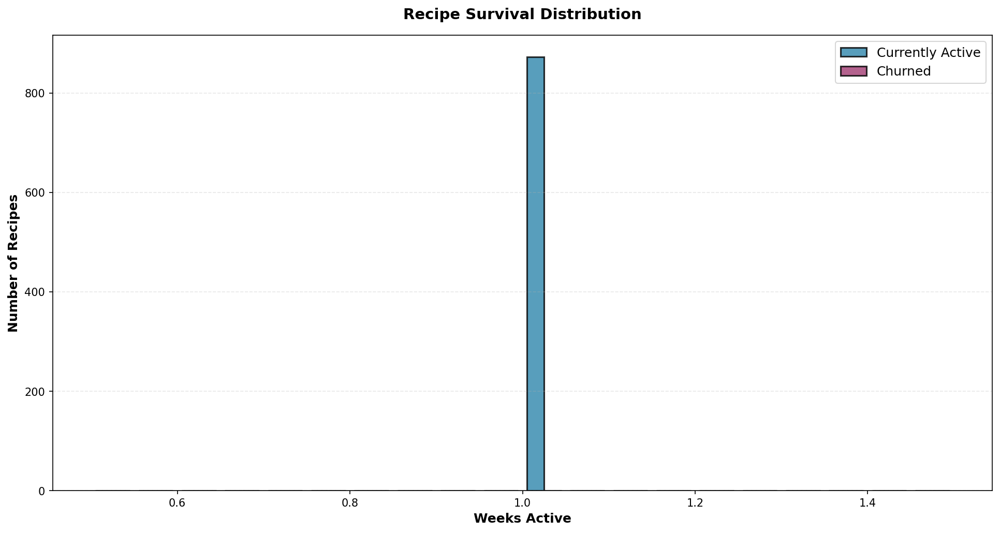
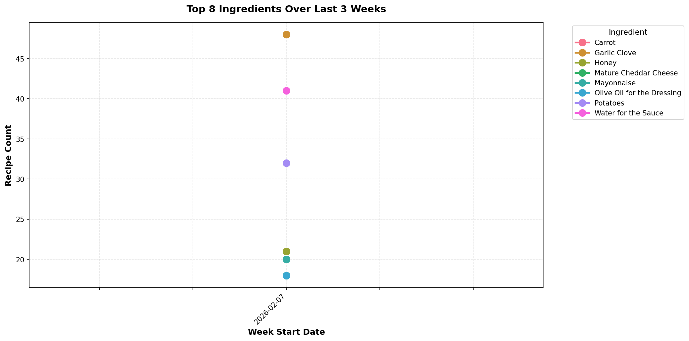
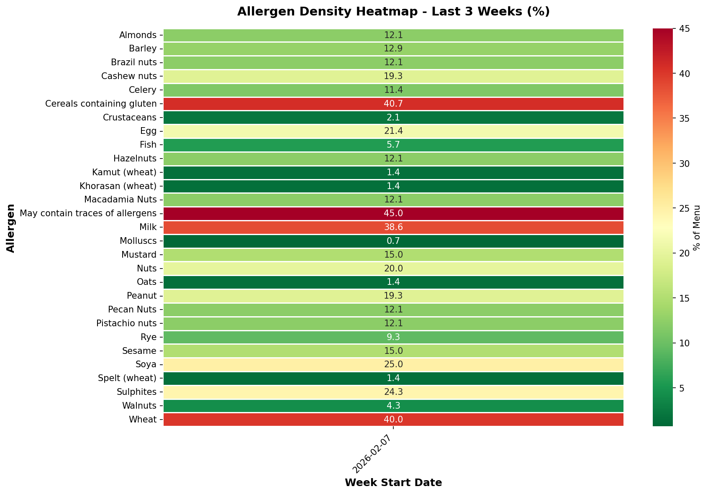

# HelloFresh Data Analysis Report

**Generated:** 2026-01-26 21:29
**Analysis Period:** Week of 2026-02-21
**Data Source:** SQLite Gold Layer

---

## Executive Summary

- **Total Recipes This Week:** 148
- **New Recipes Introduced:** 0
- **Returning Recipes:** 148
- **Average Difficulty:** 1.36
- **Average Prep Time:** 0.0 minutes

## 1. Menu Evolution

### Key Findings

## 2. Recipe Lifecycle Analysis

### Top Recipes (Current Week)
1. **Roasted Butternut Squash and Ditali Halloumi Pasta Salad** (Difficulty 1.0)
2. **Super Quick Curried Double Beef Couscous Bowl** (Difficulty 1.0)
3. **Herby Beef Meatballs in Harissa Sauce** (Difficulty 1.0)
4. **Chorizo and Chicken Sun-Dried Tomato Orzo** (Difficulty 2.0)
5. **Chermoula Beef Meatballs and Herby Bulgur Wheat** (Difficulty 2.0)

## 3. Ingredient Trends

### Trending Ingredients
- **Garlic Clove**: 48 recipes
- **Water for the Sauce**: 41 recipes
- **Potatoes**: 32 recipes
- **Honey**: 21 recipes
- **Carrot**: 21 recipes

## 4. Allergen Analysis

## 5. Ingredient Insights

### Top 10 Most Used Ingredients
1. **Garlic Clove** (48 recipes)
2. **Water for the Sauce** (41 recipes)
3. **Potatoes** (32 recipes)
4. **Honey** (21 recipes)
5. **Carrot** (21 recipes)
6. **Mayonnaise** (20 recipes)
7. **Olive Oil for the Dressing** (18 recipes)
8. **Mature Cheddar Cheese** (18 recipes)
9. **Chicken Stock Paste** (17 recipes)
10. **Baby Spinach** (17 recipes)

## 6. Cuisine Distribution

1. **Unknown** - 873 recipes

## 7. Recipe Lifecycle

- **Active:** 873 recipes (avg 0.0 days active)

## Data Quality Notes

- **Report Generated:** 2026-01-26T21:29:23.055790
- **Week Start Date:** 2026-02-21
- **Data Source:** SQLite Database

---

*This report was generated automatically by the HelloFresh Data Platform.*
*Charts are updated weekly and stored in the output/charts/ directory.*