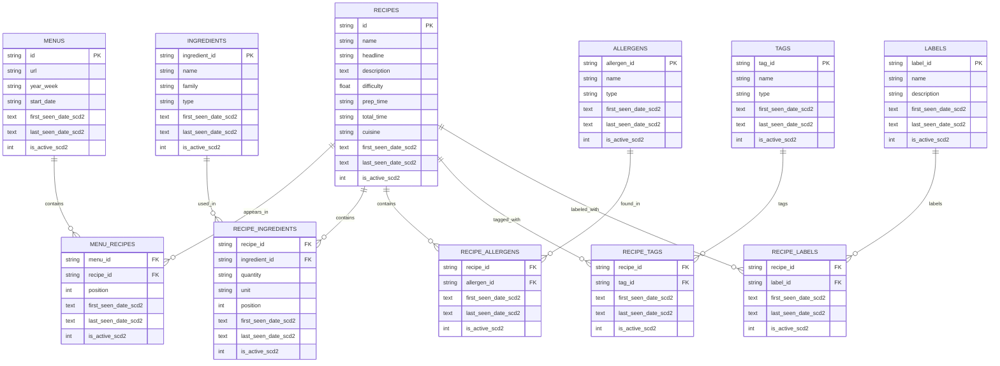

We will need to update scripts\3_gold_analytics.py if we make more table

Is there any other gold analytics tables that we can created based on the ERD? I want to show something insightful on the dashboard using the components of the er diagram

Here it is:

Looking at your ERD, I can suggest several valuable gold analytics tables that would provide insightful visualizations:

## Recommended New Gold Tables

### **1. Recipe Tags Analytics** (Most Valuable)
Track recipe **categories/tags** over time (e.g., "quick", "healthy", "vegetarian")
- Shows what types of recipes are being featured
- Trends in recipe categories per week
- **Chart**: Stacked bar or area chart of tag distribution per week yes

### **3. Ingredient Complexity Metrics**
Analyze recipe **complexity** based on ingredient count
- Average ingredients per recipe per week
- Ingredient diversity trends
- **Chart**: Line chart showing avg ingredients/recipe over time

Would you like me to:
1. **Implement Recipe Tags table** as a new gold table?
2. **Create a chart** for it in the dashboard?
3. **Add both cuisine trends & ingredient complexity** as well?

Let me know which you'd like, and I'll add them to 3_gold_analytics.py and the dashboard!:

## Implementation Summary

### **1. New Gold Analytics Tables**
- **recipe_tags_analytics**: Tracks recipe tags (categories) over time with:
  - Tag name and ID
  - Weekly recipe count using each tag
  - Percentage of menu featuring that tag
  - Popularity ranking per week
  - **Result**: 258 records generated

- **ingredient_complexity_metrics**: Tracks ingredient complexity trends with:
  - Average ingredients per recipe
  - Min/max ingredient counts per week
  - Median ingredients
  - **Result**: 6 records generated (one per week of data)

### **2. Chart Generation Functions**
Added two new Plotly charts to report_utils.py:

- **Recipe Tags Chart**: Area chart showing the distribution of top 8 recipe tags over time
  - Shows tag trends as percentage of menu
  - Stacked area visualization for easy comparison
  - 48 data points across 6 weeks

- **Ingredient Complexity Chart**: Line chart with range visualization
  - Shows average ingredients per recipe over time
  - Includes min-max range as shaded area
  - Tracks complexity trends week-by-week

### **3. Dashboard Integration**
Both charts are now embedded in **5_dashboard.py** as sections:
- **Chart 5**: Recipe Tags Distribution
- **Chart 6**: Ingredient Complexity Metrics

### **4. Files Modified**
- init_sqlite.py - Added new table definitions
- 3_gold_analytics.py - Added computation functions
- report_utils.py - Added chart generation functions  
- 5_dashboard.py - Integrated new charts into dashboard

The dashboard has been successfully generated at index.html with all 6 interactive charts!

Made changes.